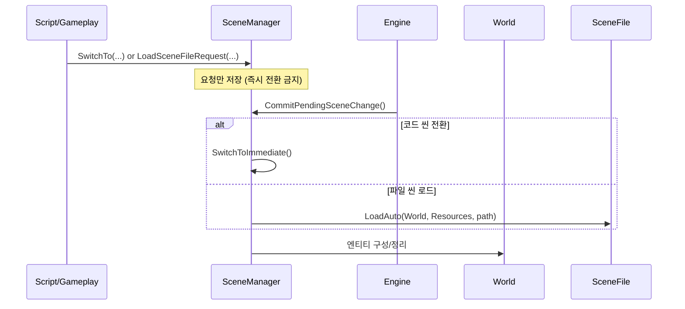

# 씬 관리와 전환 흐름 (최신 구조)

## 씬의 종류

### 1. 코드 씬 (Code Scene)
**정의**: `IScene` 인터페이스를 구현한 C++ 클래스

**특징**:
- 컴파일 타임에 코드로 정의됨
- `REGISTER_SCENE()` 매크로로 자동 등록
- 이름으로 전환 가능

**예시**:
```cpp
class SampleScene : public IScene {
    void OnEnter(World& world, ResourceManager& resources) override;
    void OnExit(World& world, ResourceManager& resources) override;
    void Update(World& world, ResourceManager& resources, float deltaTime) override;
};

REGISTER_SCENE(SampleScene);
```

### 2. 파일 씬 (File Scene)
**정의**: `.scene` 파일(JSON)로 저장된 씬 데이터

**특징**:
- RTTR 기반 직렬화
- 에디터에서 생성/저장/수정
- 런타임 로드 가능
- `SceneFile::Load()` 또는 `SceneFile::LoadAuto()`로 로드

**파일 위치**:
- 에디터 모드: `Assets/Scenes/*.scene`
- 게임 모드: `Cooked/Chunks` 경로로 매핑

---

## 씬 등록 시스템

### SceneFactory (씬 팩토리)
**위치**: `Engine/src/Runtime/Resources/Scene.h`

**등록 과정**:
```cpp
REGISTER_SCENE(SampleScene);
// 내부적으로 SceneRegistrar가 SceneFactory에 등록
```

**생성 과정**:
```cpp
auto scene = SceneFactory::Create("SampleScene");
```

---

## 씬 전환 API

### 1. SwitchToImmediate (즉시 전환)
**용도**: 엔진 초기화나 안전 지점에서만 사용

```cpp
SceneManager::SwitchToImmediate("SampleScene");
```

### 2. SwitchTo (지연 전환 요청)
**용도**: 스크립트/게임플레이에서 안전하게 호출

```cpp
SceneManager::SwitchTo("SampleScene");
```

### 3. LoadSceneFileRequest (파일 씬 지연 로드)
```cpp
SceneManager::LoadSceneFileRequest("Assets/Scenes/Main.scene");
```

### 4. CommitPendingSceneChange (커밋)
**용도**: 엔진이 프레임 경계에서만 호출

```cpp
SceneManager::CommitPendingSceneChange(world);
```

---

## ScriptSystem과의 연결

스크립트는 **SceneManager에 직접 즉시 전환을 요청하지 않습니다**.
대신 `ScriptAPI`를 통해 **지연 요청**만 등록합니다.

```cpp
// ScriptAPI
virtual void SwitchTo(const char* sceneName) = 0;
virtual bool LoadSceneFileRequest(const char* scenePathUtf8) = 0;
```

엔진이 프레임 안전 지점에서 `CommitPendingSceneChange()`를 호출하여 실제 전환을 수행합니다.

---

## 씬 전환 흐름도 (요약)



---

## SceneFile 로드 흐름

**위치**: `Engine/src/Runtime/Resources/SceneFile.h/.cpp`

```cpp
bool SceneFile::Load(World& world, const std::filesystem::path& path)
{
    // 1. JSON 읽기
    // 2. World::Clear()
    // 3. JSON에서 엔티티/컴포넌트 재구성
}
```

**주의**: `SceneFile::Load()`는 `World`를 완전히 Clear합니다.

---

## Engine 초기화 시 씬 로드

```cpp
bool Engine::Initialize(...)
{
    // 1. SceneManager 생성
    m_sceneManager = std::make_unique<SceneManager>(m_world, m_resourceManager);

    // 2. 게임 모드: BuildSettings 기반 파일 씬 로드 시도
    if (!m_editorMode)
    {
        // 내부에서 LoadSceneFileRequest + CommitPendingSceneChange 처리
    }

    // 3. 실패 시 SampleScene
    m_sceneManager->SwitchToImmediate("SampleScene");
}
```

---

## 게임 모드 초기 로딩(로딩 화면 + Preload)

게임 모드에서는 **씬 로드 전에 로딩 화면을 먼저 띄운 뒤 프리로드를 수행**합니다.

요약 흐름:
1. `InitializeUI()` 완료
2. `InitializePreloadAndLoadingScreen()` 진입
3. `Preload.json` 로드 → 경로 검증/중복 제거/존재 체크
4. 로딩 UI 표시(배너/상태 텍스트/게이지)
5. 시스템 초기화 + 리소스 프리로드 진행
6. “쉐이더 컴파일 완료” 표시 후 클릭 대기
7. 클릭 시 실제 씬 진입

상세 동작은 `엔진설명서/PRELOAD_SYSTEM.md`를 참고하세요.

---

## 요약

- 코드 씬과 파일 씬을 모두 지원
- **즉시 전환은 안전 지점에서만** (`SwitchToImmediate`)
- 스크립트/게임플레이는 **요청만 등록** (`SwitchTo`, `LoadSceneFileRequest`)
- 엔진이 프레임 경계에서 **CommitPendingSceneChange**로 커밋
